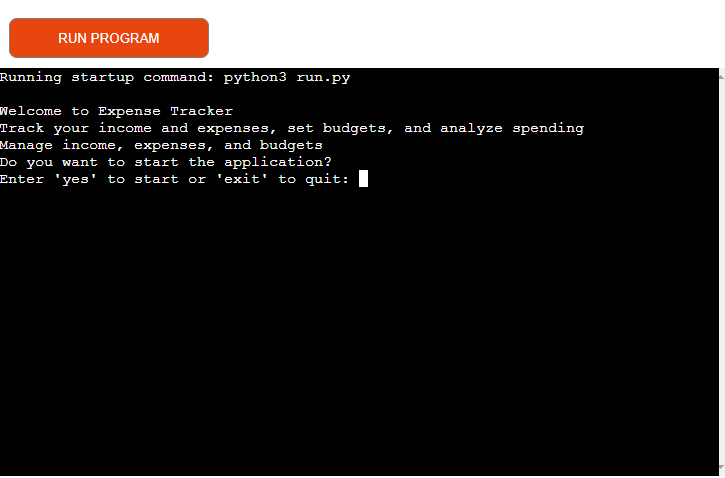

# Fin Tracker
- Deployed link: [Fin Tracker](https://fintracker-d91e74e9f79d.herokuapp.com/)
- 

 

Welcome to Fin Tracker – your personalized expense management tool!

Fin Tracker is a comprehensive expense tracking application designed to help individuals and households manage their finances effectively. Whether you're tracking your monthly expenses, setting budgets, or analyzing spending patterns, Fin Tracker has you covered.

With Fin Tracker, you can easily input your income and expenses, categorize transactions, and visualize your financial data. The intuitive user interface allows you to quickly add new transactions, set budgets for different expense categories, and monitor your spending in real-time.

Key features of Fin Tracker include:

- Income Tracking: Input your income details, including amount, description, and date, to keep track of your earnings.
- Expense Tracking: Record your expenses effortlessly by entering the amount, description, and date of each transaction.
- Budget Management: Set budgets for various expense categories such as groceries, utilities, and entertainment, and track your spending against these budgets.
- Expense Analysis: Analyze your spending patterns with detailed reports and visualizations, helping you identify areas where you can save money.
- Customizable Notifications: Receive alerts when your expenses exceed budget limits, helping you stay on track with your financial goals.

With Fin Tracker, managing your finances has never been easier. Say goodbye to the hassle of manual expense tracking and take control of your money today!
 

## Contents

### User Experience (UX)

- __User Stories__

### Design

- __Flowchart__
- __Features__

### Technologies Used

- __Languages Used__
- __Frameworks, Libraries and Programs used__

### Deployment
- __Deployment__

### Testing

- __CI Python Linter__
- __Manual Testing__
- __Solved Bug__
### Credits

- __Content__
- __Acknowledgments__

## User Stories
- As a first time user, I want the input system of the Fin Tracker to be intuitive and straightforward, guiding me through each step clearly.
- As a first time user, I expect the Fin Tracker to provide feedback and corrections if I make any mistakes during data entry, ensuring accuracy and helping me understand the system better.
- As a returning user, I aim to minimize my workload by only needing to input a few essential values into the Fin Tracker, streamlining the process of recording income, expenses, and budget information.
- As a returning user, I seek the ability to view and manage my financial data conveniently through a spreadsheet format provided by the Fin Tracker, allowing for easy tracking and analysis.
- As a returning user, I desire a quick and efficient method within the Fin Tracker to determine intervention strategies for my students based on their financial performance, enabling me to provide timely support and guidance as needed.

## Design

### Flowchart
[First draft flowchart made before starting the project](assets/images/flowchart.png)
 

### Features
- Budget Setting and Tracking:
    - __Set budgets: For groceries, utilities, entertainment.__
    - __Validate input: Ensure positive numbers; provide error feedback.__
[Screenshot of budget entry and validation screen](assets/images/budget-validation.png)
    - __Track expenses: Notify if exceeding budget.__
[Screenshot of exceeded expense](assets/images/exceeded-expense.png)
    - __Data stored in "fin-tracker" Google Sheets.__
 

- Income Tracking:
    - __Input income data: Users input amount, description, and date.__
    - __Validate input: Ensure positive numbers; provide error feedback.__
[Screenshot of income input and validation screen](assets/images/income-validation.png)
    - __Data stored in "fin-tracker" Google Sheets.__
 

- Expense Tracking:
    - __Input expense data: Amount, description, date.__
    - __Validate input: Ensure positive numbers; provide error feedback.__
[Screenshot of expense input and validation screen](assets/images/expense-validation.png)
    - __Data stored in "fin-tracker" Google Sheets.__
- Financial Analysis:
    - __Summary: Total incomes, expenses.__
    - __Budget allocation: Summary of budget vs. actual expenses.__
    - __Calculate remaining amount.__
[Screenshot of remaining amount](assets/images/remaining-amount.png)
 

- User Interaction:
    - __Prompted options: Add income, expense, or exit.__
    - __Feedback on invalid inputs.__
 

- Data Visualization:
    - __Tabular display: Expense, income data.__
[Screenshot of data visualization](assets/images/display.png)
    - __Budget, expense summary tables.__
 

- Notification System:
    - __Alert on budget exceedance.__
[Screenshot of notification system](assets/images/notification.png)
 

## Technologies used
### Languages
- [Python](https://www.python.org/doc/essays/blurb/)
 

### Library imports
- gspread 
- google.oauth2.service_account
- rich
- os
- datetime
 

### Other tools
- [Google sheets](https://www.google.co.uk/sheets/about/)
- [GitHub](https://github.com/)
- [GitPod](https://gitpod.io/)
- [Heroku](https://www.heroku.com/)
 

## Testing
### CI Python Linter
- I consistently tested the program throughout the development phase to guarantee its functionality.
- Employed the CI Python Linter Checker tool to evaluate my code. The evaluation yielded no errors. [Screenshot of CI Python Linter result](assets/images/code-validation.png)
 

### Manual Testing

| Test Case | Description | Input | Expected Outcome | Actual Outcome | Pass/Fail |
|-----------|-------------|-------|------------------|----------------|-----------|
| 1         | Valid choice from main menu | 1 | Navigate to "Set Budget" | Navigated to "Set Budget" | Pass |
| 2         | Valid choice from main menu | 2 | Navigate to "Add Income" | Navigated to "Add Income" | Pass |
| 3         | Valid choice from main menu | 3 | Navigate to "Add Expense" | Navigated to "Add Expense" | Pass |
| 4         | Valid choice from main menu | 4 | Navigate to "Analyze Expenses" | Navigated to "Analyze Expenses" | Pass |
| 5         | Valid choice from main menu | 5 | Exit the application | Application exited | Pass |
| 6         | Invalid choice from main menu | a | Display error message | Displayed error message | Pass |
| 7         | Invalid choice from main menu | -1 | Display error message | Displayed error message | Pass |
| 8         | Invalid choice from main menu | 6 | Display error message | Displayed error message | Pass |
| 9         | Invalid choice from main menu | *empty* | Display error message | Displayed error message | Pass |
| 10        | Valid choice from submenu | 1 | Add new income entry | Added new income entry | Pass |
| 11        | Valid choice from submenu | 2 | Update existing income entry | Updated existing income entry | Pass |
| 12        | Valid choice from submenu | 3 | Remove existing income entry | Removed existing income entry | Pass |
| 13        | Valid choice from submenu | 4 | Navigate back to main menu | Navigated back to main menu | Pass |
| 14        | Invalid choice from submenu | a | Display error message | Displayed error message | Pass |
| 15        | Invalid choice from submenu | -1 | Display error message | Displayed error message | Pass |
| 16        | Invalid choice from submenu | 5 | Display error message | Displayed error message | Pass |
| 17        | Invalid choice from submenu | *empty* | Display error message | Displayed error message | Pass |
| 18        | Valid index for income update | 1 | Navigate to update income entry with index 1 | Navigated to update income entry with index 1 | Pass |
| 19        | Valid index for income update | 5 | Navigate to update income entry with index 5 | Navigated to update income entry with index 5 | Pass |
| 20        | Invalid index for income update (out of range) | 10 | Display error message | Displayed error message | Pass |
| 21        | Invalid index for income update (non-integer) | a | Display error message | Displayed error message | Pass |
| 22        | Invalid index for income update (negative integer) | -1 | Display error message | Displayed error message | Pass |
| 23        | Valid index for income removal | 1 | Remove income entry with index 1 | Removed income entry with index 1 | Pass |
| 24        | Valid index for income removal | 5 | Remove income entry with index 5 | Removed income entry with index 5 | Pass |
| 25        | Invalid index for income removal (out of range) | 10 | Display error message | Displayed error message | Pass |
| 26        | Invalid index for income removal (non-integer) | a | Display error message | Displayed error message | Pass |
| 27        | Invalid index for income removal (negative integer) | -1 | Display error message | Displayed error message | Pass |

### Solved bug
I encountered an issue during deployment due to the failure of pip3 freeze > requirements.txt to generate the required libraries automatically. Consequently, I manually searched for the missing libraries and their versions to resolve the issue.
 

## Deployment
- The program was deployed on [Heroku](https://www.heroku.com/).
- You can access the deployed application [here](https://fintracker-d91e74e9f79d.herokuapp.com/).

Deployment Steps:

1. In the workspace (such as GitPod), run the command pip3 freeze > requirements.txt in the terminal. This command generates a list of requirements needed for the project to run and saves it in the requirements.txt file.
2. Create a [Heroku](https://www.heroku.com/) account if you haven't already.
3. After creating a Heroku account, navigate to the Dashboard and click on "Create New App" (you may need to click the "New" tab first and then select "Create New App" from the dropdown menu).
4. Choose a unique name for your app and select the appropriate region.
5. Once the app is created, go to the "Settings" section from the navigation bar.
6. Scroll down to the "Config Vars" section and click on "Reveal Config Vars". 
7. Add a new Config Var with "KEY" as "CREDS". Open the "creds.json" file from your workspace, copy its contents, and paste them into the "VALUE" field. Click "Add".
8. Add another Config Var with "KEY" as "PORT" and "VALUE" as "8000".
9. Scroll down to the "Buildpacks" section and click on "Add Buildpack".
10. Add the Python buildpack first, then add the Node.js buildpack.
11. Make sure the buildpacks are in the correct order (Python first, then Node.js). You can drag and drop them if needed.
12. Scroll back to the top navigation bar and click on "Deploy".
13. Next to "Deployment method", select "GitHub". Connect to your GitHub repository by typing its name, searching for it, and connecting to it.
14. Enable automatic deploys and then manually deploy the branch.
15. Wait for the app to be deployed.
 

## Future improvements
- User Authentication: Implement user authentication to allow multiple users to track their income and expenses securely. This could include features like user registration, login, and password recovery.
- Mobile Compatibility: Optimize the application for mobile devices to allow users to track their finances on the go. This could involve creating a responsive design or developing dedicated mobile apps for iOS and Android platforms.
 

## Credits
### Content

My project was inspired by Code Institute's Love Sandwiches project. I adapted the code, changed its purpose, and crafted unique functions to make it my own.
 

### Acknowledgements

My mentor Matt Bodden for his support and assistance. 